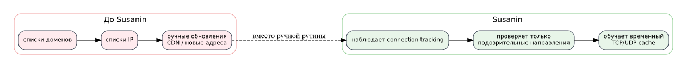
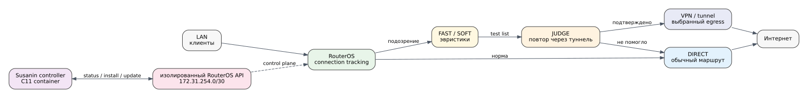
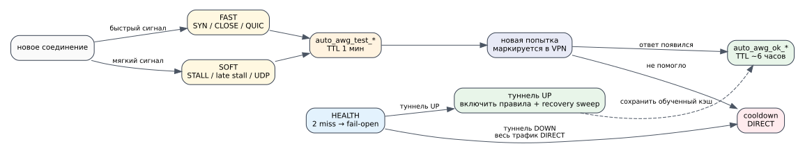
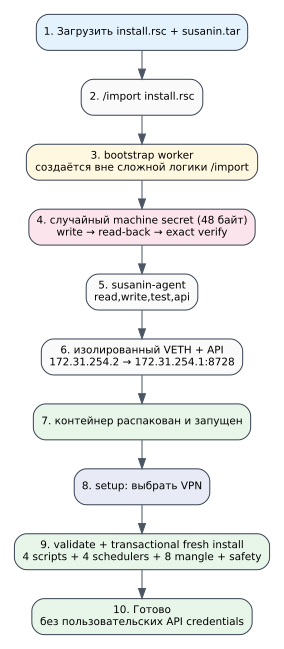
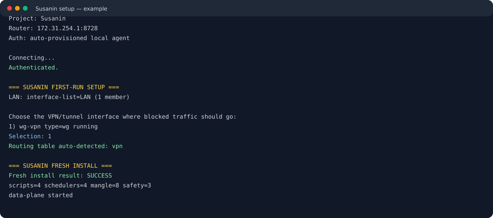
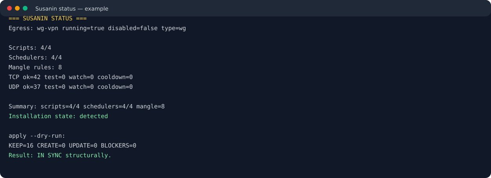
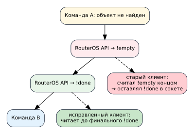

> **PILOT / EXPERIMENTAL.** Susanin is an early-stage project that actively changes RouterOS routing and firewall objects. Make a backup before installation. At the moment the public target is **ARM64** and the reference test platform is **RouterOS 7.23.3**.
>
> This project is not affiliated with or endorsed by MikroTik, Amnezia, WireGuard, OpenAI or the authors of the projects mentioned below.

# Сусанин — адаптивная маршрутизация через VPN для MikroTik

[](https://en.cppreference.com/w/c/11)
[](https://mikrotik.com/)
[](#требования)
[](#статус-проекта)
[](LICENSE)


**Сусанин** пытается понять, какие направления у клиента реально ломаются при обычном прямом доступе, проверяет их повторной попыткой через выбранный туннель и временно запоминает рабочий путь. Вместо ручного ведения тысяч доменов и IP используется поведение соединений в RouterOS `connection tracking`.

Пользовательская идея максимально простая:

```text
загрузить susanin.tar + install.rsc
        ↓
/import file-name=install.rsc
        ↓
дождаться запуска контейнера
        ↓
выбрать VPN-интерфейс
        ↓
готово
```

Без ввода API-логина, API-пароля, адреса роутера, списка доменов или ручного выбора routing table.

## Почему появился этот проект

До Susanin я маршрутизировал нужные сайты через VPN с помощью доменных и IP-списков. Это работает, пока список маленький. Потом появляются CDN, новые подсети, QUIC, разные адреса для TCP/UDP, временные блокировки и постоянная ручная поддержка.

Сильным толчком стал проект **[timbrs/amneziawg-mikrotik-c](https://github.com/timbrs/amneziawg-mikrotik-c)** и подробная статья автора **[«Наконец-то: AmneziaWG в Mikrotik»](https://habr.com/ru/articles/1002824/)**. Он показал очень практичный подход: не пытаться переписать весь сетевой стек, а оставить то, что RouterOS уже умеет хорошо, и добавить минимальный недостающий слой. Susanin следует той же философии, но решает другую задачу — автоматический выбор маршрута для проблемных направлений.

Разработка велась с активным использованием ChatGPT. Автор проекта — сетевой инженер и специалист по ИБ, а не профессиональный разработчик C. Поэтому код, протокол и поведение проверялись итеративно на реальном MikroTik, а найденные ошибки и ограничения RouterOS фиксировались по мере тестирования. Это одна из причин, почему проект пока имеет статус **pilot**.

## Содержание

- [Что делает Susanin](#что-делает-susanin)
- [Как это работает](#как-это-работает)
- [FAST / SOFT / JUDGE / HEALTH](#fast--soft--judge--health)
- [Почему data plane остаётся в RouterOS](#почему-data-plane-остаётся-в-routeros)
- [Требования](#требования)
- [Быстрый старт](#быстрый-старт)
- [Проверка после установки](#проверка-после-установки)
- [Логи и наблюдение](#логи-и-наблюдение)
- [Обновление](#обновление)
- [Удаление](#удаление)
- [Безопасность bootstrap](#безопасность-bootstrap)
- [Что Susanin создаёт в RouterOS](#что-susanin-создаёт-в-routeros)
- [Устранение неполадок](#устранение-неполадок)
- [Сборка из исходников](#сборка-из-исходников)
- [Статус проекта](#статус-проекта)
- [Благодарности](#благодарности)

## Что делает Susanin

Susanin **не является VPN-клиентом** и не поднимает AmneziaWG/OpenVPN/WireGuard за пользователя. Туннель должен уже существовать как route-based interface в RouterOS.

Susanin:

- обнаруживает LAN через RouterOS interface-list `LAN`;
- показывает только похожие на route-based tunnel интерфейсы;
- просит выбрать один VPN/tunnel egress;
- автоматически ищет подходящую routing table;
- если однозначной таблицы нет — может создать отдельную FIB-таблицу `susanin` и default route через выбранный интерфейс;
- генерирует RouterOS scripts под реальные LAN IPv4-сети и адрес туннеля;
- валидирует сгенерированные scripts самим RouterOS перед commit;
- транзакционно устанавливает data plane;
- наблюдает connection tracking и временно обучает TCP/UDP destination cache;
- при недоступности туннеля делает **fail-open в DIRECT**;
- после восстановления туннеля автоматически возвращает adaptive routing.

Susanin **не**:

- ведёт статический список сайтов;
- не парсит DNS-имена, TLS SNI или содержимое пакетов;
- не проксирует пользовательский трафик через контейнер Susanin;
- не требует пользовательского RouterOS API-пароля;
- не отправляет телеметрию куда-либо наружу.



## Как это работает

Data plane живёт непосредственно в RouterOS. Контейнер Susanin — это control plane: установка, discovery, генерация конфигурации, проверка, status, upgrade/rollback.



Клиент сначала идёт обычным маршрутом. Если connection tracking показывает характерный сбой, destination IP попадает во временный тестовый список для **того же протокола**. Следующая попытка клиента к этому IP маркируется и отправляется через выбранную routing table.

Если через VPN ответ появляется, адрес временно подтверждается. Если не появляется — destination уходит в cooldown и остаётся DIRECT.

TCP и UDP обучаются **раздельно**. Один и тот же IP может быть подтверждён для UDP/443 и не подтверждён для TCP/443 — это нормальное состояние.

### Кэш

Основные динамические списки:

```text
auto_awg_watch_tcp
auto_awg_test_tcp
auto_awg_ok_tcp
auto_awg_cooldown_tcp

auto_awg_watch_udp
auto_awg_test_udp
auto_awg_ok_udp
auto_awg_cooldown_udp
```

Подтверждённые направления живут примерно 6 часов и обновляются при здоровом активном трафике. Это self-cleaning cache, а не постоянная база доменов/IP.

## FAST / SOFT / JUDGE / HEALTH



### FAST — быстрые признаки

Запускается часто и ловит сигналы, которые можно заметить быстро:

- TCP SYN без ответа;
- короткий TCP CLOSE/RST с минимальным ответом;
- QUIC/UDP 443 без reply.

Примеры логов:

```text
AUTO-AWG: FAST TCP-SYN 203.0.113.10:443
AUTO-AWG: FAST TCP-CLOSE 203.0.113.11:443
AUTO-AWG: FAST QUIC 203.0.113.12:443
```

### SOFT — более осторожные эвристики

Ищет ситуации, где соединение формально существует, но обмен похож на stall:

- TCP established с большим количеством исходящих пакетов и почти без ответов;
- late stall с debounce;
- UDP no-reply вне служебных портов;
- QUIC late stall.

Пример:

```text
AUTO-AWG: SOFT TCP-STALL 203.0.113.20:443
AUTO-AWG: SOFT TCP-LATE-STALL 203.0.113.21:443
```

### JUDGE — проверка гипотезы

FAST/SOFT не говорят «этот IP надо навсегда отправлять в VPN». Они говорят только «стоит проверить».

JUDGE смотрит на новую попытку, уже направленную через VPN:

- появился нормальный reply → `CONFIRMED`;
- через VPN тоже не работает → cooldown / DIRECT;
- подтверждение делается отдельно для TCP и UDP.

```text
AUTO-AWG: CONFIRMED 203.0.113.30 via tcp:443
AUTO-AWG: CONFIRMED 203.0.113.30 via udp:443
```

### HEALTH — fail-open и recovery

HEALTH проверяет доступность туннеля. После двух miss adaptive mangle отключается, тестовые состояния очищаются, и клиенты продолжают работать DIRECT.

```text
AUTO-AWG: tunnel DOWN after 2 health misses, fallback to DIRECT
```

Когда туннель снова отвечает:

```text
AUTO-AWG: tunnel UP, recovery TCP=0 UDP=0
```

правила включаются обратно. При необходимости recovery sweep сбрасывает старые DIRECT connection-tracking записи для уже подтверждённых направлений.

На тестовом reboot сначала срабатывал fail-open, пока VPN-контейнер ещё поднимался, а затем HEALTH самостоятельно восстановил adaptive routing — именно это считается нормальным поведением.

## Почему data plane остаётся в RouterOS

Была идея перенести per-second анализ connection tracking в контейнер. От неё отказались.

Причины:

- RouterOS scripts находятся непосредственно рядом с connection tracking и firewall;
- нет API round-trip на каждый цикл FAST/SOFT/JUDGE;
- при падении/обновлении Susanin container текущая маршрутизация продолжает работать;
- control plane можно обновлять отдельно от data plane;
- контейнер остаётся лёгким и почти всё время спит.

То есть Susanin controller — не прокси в пути трафика.

## Требования

### Проверенная конфигурация

- **ARM64 MikroTik**;
- **RouterOS 7.23.3** — реальная тестовая версия;
- пакет `container`;
- включённый device-mode для containers/scheduler;
- IPv4 LAN interface-list с именем `LAN`;
- минимум одна IPv4 LAN-сеть на интерфейсе из списка `LAN`;
- уже работающий route-based VPN/tunnel interface с IPv4-адресом.

> Другие RouterOS версии могут работать, но пока не считаются полноценно проверенными. Другие архитектуры в публичном пилоте не поддерживаются.

### Подготовка RouterOS

Установите пакет `container`, затем разрешите containers. На версиях RouterOS, где device-mode отдельно ограничивает scheduler, разрешите и его:

```routeros
/system/device-mode/update container=yes scheduler=yes
```

RouterOS может потребовать физическое подтверждение изменения device-mode.

### LAN

Susanin сейчас ожидает interface-list:

```routeros
/interface list print where name="LAN"
/interface list member print where list="LAN"
```

И хотя бы один IPv4 адрес на одном из его интерфейсов:

```routeros
/ip address print
```

### VPN / tunnel

Туннель должен быть поднят заранее. В текущей версии setup умеет распознавать типы вроде `wg`, `ovpn-out`, `sstp-out`, `l2tp-out`, GRE/IPIP и некоторые другие route-based интерфейсы, но реальная эксплуатационная проверка выполнялась с WireGuard/AmneziaWG route-based egress.

Если у выбранного интерфейса нет IPv4-адреса, генерация health script будет заблокирована.

## Быстрый старт

### 0. Сделайте backup

Обязательно:

```routeros
/system backup save name=before-susanin dont-encrypt=yes
/export file=before-susanin
```

Не публикуйте `show-sensitive` export и `.backup` в issues/GitHub — они могут содержать ключи, пароли и другие секреты.

### 1. Скачайте release

Из GitHub Release нужны два файла:

```text
susanin.tar
install.rsc
```

Для удаления также можно скачать `uninstall.rsc`.

### 2. Загрузите файлы в RouterOS

Через WinBox → **Files**, SCP или другим удобным способом.

Проверьте:

```routeros
/file print where name~"susanin.tar|install.rsc"
```

### 3. Опциональный parser dry-run

```routeros
/import file-name=install.rsc verbose=yes dry-run
```

Ожидается:

```text
No syntax errors found in the import file
```

### 4. Установите bootstrap

```routeros
/import file-name=install.rsc verbose=yes
```

Bootstrap:

- создаст изолированный `bridge-susanin` + `veth-susanin`;
- создаст внутреннюю машинную учётку `susanin-agent`;
- сгенерирует случайный 48-байтный machine secret;
- проверит запись secret byte-for-byte до смены machine password;
- разрешит RouterOS API для изолированного адреса controller;
- распакует `susanin.tar`;
- запустит controller;
- удалит временный elevated bootstrap helper.



### 5. Дождитесь RUNNING

```routeros
/container print where name="susanin-controller"
```

Нужен флаг `R`.

### 6. Запустите setup

```routeros
/container/shell susanin-controller \
  cmd="/usr/local/bin/susanin setup" \
  no-sh \
  timeout=300
```

Пример:

```text
=== SUSANIN FIRST-RUN SETUP ===
LAN: interface-list=LAN (1 member)

Choose the VPN/tunnel interface where blocked traffic should go:
  1) wg-vpn                   type=wg         running
Selection: 1
Routing table auto-detected: vpn

Installing/reconciling Susanin data-plane...
...
Fresh install result: SUCCESS
```

Если для выбранного tunnel нет однозначной отдельной routing table, Susanin попытается создать таблицу `susanin` и default route через выбранный интерфейс.



### 7. Проверьте status

```routeros
/container/shell susanin-controller \
  cmd="/usr/local/bin/susanin status" \
  no-sh \
  timeout=60
```

После fresh install ожидается:

```text
Summary: scripts=4/4 schedulers=4/4 mangle=8
Installation state: detected
```



### 8. Проверка reconciliation

```routeros
/container/shell susanin-controller \
  cmd="/usr/local/bin/susanin apply --dry-run" \
  no-sh \
  timeout=60
```

Нормальное состояние:

```text
KEEP=16 CREATE=0 UPDATE=0 BLOCKERS=0
Result: IN SYNC structurally.
```

## Проверка после установки

### Data plane

```routeros
/system scheduler print where name~"auto-awg-"
/ip firewall mangle print where comment~"^AUTO-AWG:"
/ip firewall mangle print where comment~"^SUSANIN:"
```

Ожидается:

- 4 scheduler;
- 8 managed mangle rules;
- 3 private-network safety bypass rules.

### Secret

Не выводите содержимое файла. Проверяйте только размер:

```routeros
/file print where name="susanin-secrets/routeros_password"
```

Ожидаемый размер — `48`.

### API

```routeros
/ip service print detail where name="api"
```

Bootstrap добавляет `172.31.254.2/32` в allowed addresses и узкое firewall-правило для controller. Если API раньше был выключен, bootstrap включает его.

## Логи и наблюдение

### Живой лог решений

```routeros
/log print follow-only where message~"AUTO-AWG:"
```

Или последние события:

```routeros
/log print where message~"AUTO-AWG:"
```

Основные сообщения:

| Сообщение | Что означает |
|---|---|
| `FAST TCP-SYN` | исходящие SYN повторяются без ответа |
| `FAST TCP-CLOSE` | короткая неуспешная TCP-сессия |
| `FAST QUIC` | UDP/443 без reply |
| `SOFT TCP-STALL` | соединение похоже на зависшее |
| `SOFT TCP-LATE-STALL` | stall подтверждён debounce-логикой |
| `SOFT UDP` | UDP-трафик без ответов |
| `CONFIRMED ... via tcp` | повтор через VPN помог для TCP |
| `CONFIRMED ... via udp` | повтор через VPN помог для UDP |
| `tunnel DOWN ... DIRECT` | health перевёл систему в fail-open |
| `tunnel UP ...` | туннель восстановился, adaptive rules включены |

Логи содержат destination IP/порт, но не payload, не доменное имя и не пользовательские credentials.

### Состояние обученного кэша

```routeros
/ip firewall address-list print where list~"auto_awg_"
```

Или компактно через controller:

```routeros
/container/shell susanin-controller cmd="/usr/local/bin/susanin status" no-sh timeout=60
```

### Health

```routeros
/ip firewall address-list print where list="auto_awg_health_fail"
/ip firewall mangle print where comment~"^AUTO-AWG:"
```

Если туннель временно недоступен, managed mangle может быть отключён — это fail-open. После восстановления HEALTH должен включить правила обратно.

### Диагностика control plane

```routeros
/container print detail where name="susanin-controller"
/container mounts print detail where list~"susanin"
/ip service print detail where name="api"
/ip firewall filter print detail where comment="SUSANIN: allow controller API"
```

## Команды controller

```text
susanin discover
susanin plan
susanin status
susanin apply --dry-run
susanin snapshot
susanin render
susanin validate
susanin stage
susanin stage-clean
susanin promote --dry-run
susanin promote
susanin rollback
susanin setup
susanin install --dry-run
susanin install
susanin version
```

Обычному пользователю в первую очередь нужны `setup`, `status` и `apply --dry-run`.

## Обновление

Пилотная схема обновления controller:

1. Сделайте backup RouterOS.
2. Скачайте новый `susanin.tar` и `install.rsc`.
3. Загрузите их в Files.
4. Выполните `dry-run` импорта.
5. Выполните `/import file-name=install.rsc verbose=yes`.
6. Дождитесь `R` у `susanin-controller`.
7. Выполните `status` и `apply --dry-run`.

Data plane остаётся в RouterOS и продолжает работать, пока controller заменяется.

Для контролируемой замены source уже существующих managed scripts есть `stage → promote → rollback`. Это более низкоуровневый механизм и пока предназначен прежде всего для тестирования/обновлений проекта.

## Удаление

`bootstrap/uninstall.rsc` удаляет Susanin controller и managed data plane, но **не удаляет сам VPN/tunnel**.

Перед удалением:

```routeros
/system backup save name=before-susanin-uninstall dont-encrypt=yes
```

Загрузите `uninstall.rsc` и выполните:

```routeros
/import file-name=uninstall.rsc verbose=yes
```

Если Susanin автоматически создавал default route с комментарием `SUSANIN: default route via selected tunnel`, uninstall удалит именно этот route. Саму routing table `susanin` скрипт намеренно не удаляет автоматически, чтобы не затронуть чужие маршруты; пустую таблицу можно удалить вручную после проверки.

## Безопасность bootstrap

Susanin **не просит** пароль администратора RouterOS.

Модель:

```text
RouterOS admin запускает install.rsc
          ↓
временный bootstrap worker
          ↓
random 48-byte secret
          ↓
read-back exact verification
          ↓
susanin-agent (read,write,test,api)
          ↓
изолированный /30
          ↓
Susanin container
```

Особенности:

- machine secret не передаётся через environment;
- secret не передаётся в argv;
- container читает его из `/run/secrets/routeros_password`;
- temporary bootstrap worker имеет повышенные права только на время bootstrap и удаляется одноразовым cleaner;
- API 8728 в текущем пилоте остаётся plain RouterOS API, но доступ ограничивается внутренней изолированной сетью controller;
- API-SSL — кандидат для будущей версии.

Подробно: [SECURITY.md](SECURITY.md).

## Что Susanin создаёт в RouterOS

### Controller

```text
bridge-susanin
veth-susanin
172.31.254.1/30 ↔ 172.31.254.2/30
susanin-agent
susanin-secrets/routeros_password
susanin-data/susanin.conf
susanin-controller
```

### Managed scripts

```text
auto-awg-health
auto-awg-fast
auto-awg-detect
auto-awg-judge
```

### Schedulers

```text
auto-awg-health  3s
auto-awg-fast    1s
auto-awg-detect  2s
auto-awg-judge   1s
```

### Mangle

8 правил `AUTO-AWG:` для test/confirmed TCP/UDP и routing marks.

### Safety

3 правила `SUSANIN:` не позволяют adaptive logic отправлять RFC1918 private destinations в VPN.

### NAT

Если для выбранного tunnel уже есть активный masquerade, Susanin оставляет его как есть. Иначе создаёт только свой NAT с комментарием:

```text
SUSANIN: masquerade selected tunnel
```

## Устранение неполадок

### `Cannot connect to RouterOS API at 172.31.254.1:8728`

Проверьте:

```routeros
/ip service print detail where name="api"
/ip firewall filter print detail where comment="SUSANIN: allow controller API"
/interface veth print detail where name="veth-susanin"
/ip address print detail where interface="bridge-susanin"
```

У API не должно быть флага `X`.

### `no IPv4 LAN networks found` / `no usable interfaces found`

Проверьте:

```routeros
/interface list member print detail where list="LAN"
/ip address print detail
```

И discovery:

```routeros
/container/shell susanin-controller cmd="/usr/local/bin/susanin discover" no-sh timeout=60
```

### `no route-based tunnel/VPN interfaces detected`

Проверьте, что tunnel существует, не disabled и имеет тип, который Susanin считает route-based. Для первого пилота наиболее проверенный вариант — WireGuard interface.

### `selected egress has no IPv4 address`

Назначьте IPv4 адресу tunnel interface. Health template использует этот source-address для probe.

### Mangle временно disabled

Сначала смотрите:

```routeros
/log print where message~"AUTO-AWG: tunnel"
```

Если был `tunnel DOWN`, это штатный fail-open. После восстановления probe должен появиться `tunnel UP` и rules включатся обратно.

### `partial managed installation detected`

Susanin намеренно не угадывает, какие объекты можно безопасно перезаписать. Сделайте backup, изучите `status`/`apply --dry-run`, удалите только явно оставшиеся Susanin managed objects или воспользуйтесь uninstall.

### Container не запускается после extraction

```routeros
/container print detail where name="susanin-controller"
/log print where message~"SUSANIN:"
```

Bootstrap определяет in-progress container по versioned `root-dir`, ждёт появления `arch`, затем запускает container. Temporary helper после успешного старта должен исчезнуть.

## Сборка из исходников

Требуется Docker Buildx/QEMU для ARM64 сборки на x86-хосте.

Пример:

```bash
docker run --privileged --rm tonistiigi/binfmt --install arm64

docker buildx create \
  --name way-builder \
  --driver docker-container \
  --use \
  --bootstrap

docker buildx build \
  --builder way-builder \
  --platform linux/arm64 \
  --no-cache \
  -t susanin:0.11.3 \
  --output type=docker,dest=susanin.tar \
  .
```

Проверка:

```bash
docker load -i susanin.tar
docker image inspect susanin:0.11.3 --format '{{.Os}}/{{.Architecture}}'
docker run --rm --platform linux/arm64 susanin:0.11.3 version
```

Нативная C-сборка:

```bash
make clean
make CFLAGS='-O2 -pipe -std=c11 -Wall -Wextra -Wpedantic -Werror'
./susanin version
```

## Интересные баги, найденные по дороге

Один из самых неприятных был связан с RouterOS API reply framing.

RouterOS может отвечать на пустой результат:

```text
!empty
!done
```

Старый API-клиент ошибочно считал `!empty` концом команды и оставлял `!done` в TCP stream. Следующая команда могла прочитать старый `!done` и «увидеть» пустой результат. На fresh install это проявлялось как загадочное исчезновение LAN после нескольких inventory lookup.

Исправление: команда всегда читается до финального `!done`.



Также в ходе реальных тестов встретились:

- разные типы RouterOS internal ID и неожиданный `:len`;
- асинхронная extraction контейнера;
- runtime-поведение `:for`/`:while` внутри `/import` на тестовой версии;
- нулевой secret-файл при сложной файловой транзакции непосредственно внутри `/import`;
- disabled API service на старом backup;
- необходимость self-cleanup temporary elevated bootstrap helper.

Эти детали — одна из причин, почему проект пока называется пилотом.

## Статус проекта

**Очень пилотный.** Это не «поставил на тысячу роутеров и забыл».

На реальном ARM64 MikroTik с RouterOS 7.23.3 проверены:

- credentialless bootstrap;
- clean install `0/16 → 16/16`;
- validation generated scripts;
- transactional fresh install;
- controller upgrade поверх работающего data plane;
- stage/promote/rollback source update;
- reboot после clean install;
- fail-open при старте, пока VPN ещё не поднялся;
- автоматический recovery после возвращения туннеля;
- раздельное TCP/UDP обучение.

Не проверено достаточно широко:

- разные модели MikroTik и объёмы flash/RAM;
- RouterOS до/после 7.23.3;
- большие/сложные multi-LAN схемы;
- IPv6;
- массовая работа с разными типами VPN;
- долгосрочная статистика false positive/false negative на разных провайдерах.

Пожалуйста, создавайте issues с RouterOS version, архитектурой, `status`, релевантными логами и описанием сети. **Не прикладывайте show-sensitive export, backup, WireGuard keys и пароли.**

## Благодарности

- **[timbrs/amneziawg-mikrotik-c](https://github.com/timbrs/amneziawg-mikrotik-c)** — проект, который вдохновил на практичный минималистичный подход к RouterOS containers и в итоге подтолкнул к Susanin.
- Статья **[«Наконец-то: AmneziaWG в Mikrotik»](https://habr.com/ru/articles/1002824/)** — отличный пример детального публичного разбора реальной сетевой задачи.
- ChatGPT использовался как активный помощник при разработке C-кода, ревью, анализе RouterOS API и оформлении документации. Ответственность за тестирование и публикацию результата остаётся на авторе проекта.

## Лицензия

MIT — см. [LICENSE](LICENSE).
