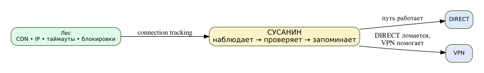

# Susanin — adaptive VPN routing for MikroTik

[](https://en.cppreference.com/w/c/11)
[](https://mikrotik.com/)
[](#requirements)
[](#project-status)
[](LICENSE)
[](https://github.com/Fiark/susanin/releases/tag/v0.11.3)
[](https://github.com/Fiark/susanin/releases)

> [!WARNING]
> **PILOT / EXPERIMENTAL**
>
> Susanin is an early-stage project that changes RouterOS routing and firewall objects.
>
> Back up your MikroTik before installation.
>
> The current public build targets **ARM64**.  
> Reference test platform: **RouterOS 7.23.3**.

> [!IMPORTANT]
> ### Download the current pilot release
>
> **[Susanin v0.11.3 — pilot](https://github.com/Fiark/susanin/releases/tag/v0.11.3)**
>
> Normal installation requires only:
>
> - **[susanin.tar](https://github.com/Fiark/susanin/releases/download/v0.11.3/susanin.tar)** — ARM64 container image
> - **[install.rsc](https://github.com/Fiark/susanin/releases/download/v0.11.3/install.rsc)** — RouterOS credentialless bootstrap
>
> Additional files:
>
> - [SHA256SUMS](https://github.com/Fiark/susanin/releases/download/v0.11.3/SHA256SUMS)
> - [uninstall.rsc](https://github.com/Fiark/susanin/releases/download/v0.11.3/uninstall.rsc)
> - [uninstall-controller.rsc](https://github.com/Fiark/susanin/releases/download/v0.11.3/uninstall-controller.rsc)




Susanin watches RouterOS connection-tracking behavior, tests suspicious destinations through a selected route-based tunnel and temporarily remembers whether TCP or UDP works better through that tunnel. It is intentionally not a domain/IP blocklist manager.

The project was inspired by [timbrs/amneziawg-mikrotik-c](https://github.com/timbrs/amneziawg-mikrotik-c) and its [Habr article](https://habr.com/ru/articles/1002824/). ChatGPT was actively used as a coding/review assistant; the author is primarily a network/security engineer rather than a professional C developer.

## Quick start

### Requirements

- ARM64 MikroTik;
- RouterOS 7.23.3 is the tested baseline;
- `container` package/device mode enabled;
- IPv4 interface-list named `LAN`;
- an already working route-based VPN/tunnel interface with an IPv4 address.

Upload from the GitHub release:

```text
susanin.tar
install.rsc
```

Optional parser check:

```routeros
/import file-name=install.rsc verbose=yes dry-run
```

Install:

```routeros
/import file-name=install.rsc verbose=yes
```

Wait for:

```routeros
/container print where name="susanin-controller"
```

to show `R`, then run:

```routeros
/container/shell susanin-controller cmd="/usr/local/bin/susanin setup" no-sh timeout=300
```

Select the tunnel interface. Susanin auto-detects a matching routing table or provisions its own dedicated table/default route, validates the generated RouterOS scripts and transactionally installs the data plane.

Status:

```routeros
/container/shell susanin-controller cmd="/usr/local/bin/susanin status" no-sh timeout=60
```

Expected after installation:

```text
Summary: scripts=4/4 schedulers=4/4 mangle=8
Installation state: detected
```

Live decisions:

```routeros
/log print follow-only where message~"AUTO-AWG:"
```

Structural reconciliation:

```routeros
/container/shell susanin-controller cmd="/usr/local/bin/susanin apply --dry-run" no-sh timeout=60
```

Expected healthy state:

```text
KEEP=16 CREATE=0 UPDATE=0 BLOCKERS=0
Result: IN SYNC structurally.
```

## Architecture

The per-second data plane stays in RouterOS scripts. The C11 container is only a control plane for discovery, rendering, validation, installation, status and upgrades. If the controller stops, the RouterOS data plane keeps running.

The bootstrap does not ask for a RouterOS username/password. It creates an isolated controller network, generates a random machine secret, verifies it before synchronizing an internal `susanin-agent`, and mounts the secret as a file instead of an environment variable.

See the Russian [README.md](README.md) for the full documentation and [SECURITY.md](SECURITY.md) for the security model.

## License

MIT.
