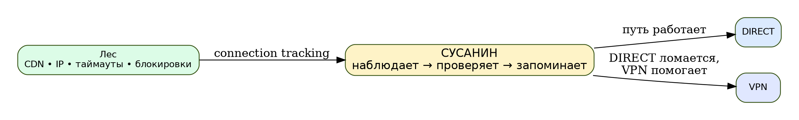
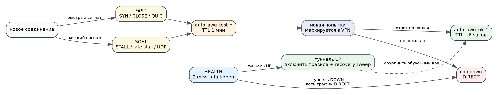
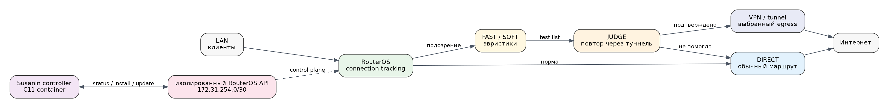
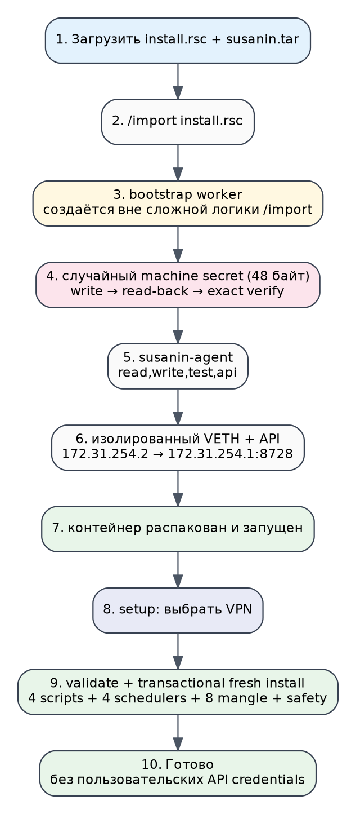
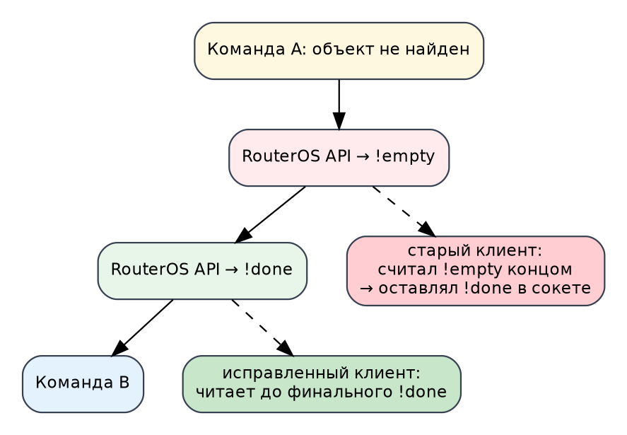
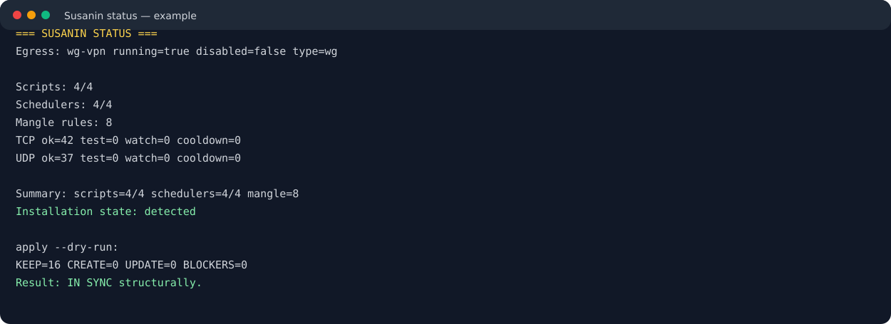

# Сусанин: как я перестал кормить MikroTik списками доменов и научил его сам искать рабочий маршрут

> **TL;DR.** Я написал пилотный ARM64-контейнер для MikroTik RouterOS, который не хранит список «какие сайты отправлять в VPN». Вместо этого RouterOS наблюдает за собственным connection tracking, замечает характерные неудачные соединения, делает одну проверочную попытку через уже существующий VPN/tunnel и временно запоминает, помог ли этот путь. TCP и UDP обучаются отдельно, при падении VPN система уходит в fail-open DIRECT. Установка — `install.rsc + susanin.tar`, после чего пользователь выбирает только VPN-интерфейс.
>
> Проект **очень пилотный**. Проверен на реальном ARM64 MikroTik с RouterOS 7.23.3, включая чистую установку, reboot, fail-open/recovery и обновление control plane. Перед экспериментами делайте backup.



Сразу две честные оговорки.

Во-первых, я не профессиональный программист. Я сетевой инженер и специалист по информационной безопасности. Я умею разбирать пакеты, маршрутизацию, firewall, гипервизоры, туннели и сетевые аномалии заметно лучше, чем писать красивый production-C. В этом проекте я активно пользовался ChatGPT: для C-кода, ревью, анализа RouterOS API, генерации гипотез и документации. Код при этом не «сгенерировал и выложил»: я последовательно гонял его на реальном роутере, ловил довольно неприятные особенности RouterOS, откатывался из backup и снова проверял clean install.

Во-вторых, идея вообще родилась не в вакууме. Меня очень вдохновил проект **[amneziawg-mikrotik-c](https://github.com/timbrs/amneziawg-mikrotik-c)** и статья его автора **[«Наконец-то: AmneziaWG в Mikrotik»](https://habr.com/ru/articles/1002824/)**. Там мне особенно понравилась инженерная философия: не переписывать то, что MikroTik уже умеет, а добавить минимальный недостающий слой. В моём случае проблема была другой — мне надоело руками вести домены и IP для selective routing.

<cut />

## Откуда взялся «Сусанин»

Название почти буквальное.

У нас есть лес: CDN, меняющиеся IP, QUIC, TCP, временные сетевые отказы, разные маршруты, динамические ответы DNS. Старый подход пытался заранее нарисовать карту этого леса: вот эти домены отправляем в VPN, вот эти IP добавляем в address-list, эти подсети обновляем скриптом.

Сусанин делает наоборот. Он не знает карту заранее. Он идёт обычным путём, смотрит, где клиент явно начинает блуждать, пробует альтернативную тропу через VPN и, если она оказалась рабочей, какое-то время помнит её.

Да, исторический Сусанин как навигатор — спорный персонаж. Поэтому название мне и понравилось: проект тоже периодически заводил меня в такие дебри RouterOS API, откуда приходилось выбираться несколько вечеров подряд.

## Почему меня окончательно достали списки доменов

Моя исходная схема была вполне классической: DNS static/address-list, отдельный `to_awg`, mangle и routing table через AmneziaWG.

Она работала.

Потом список вырос.

На одном из старых backup у меня было **1185 DNS static записей** и уже десятки IP в address-list, причём часть списка продолжала динамически наполняться. Само по себе число не катастрофическое. Проблема в другом: это постоянная ручная модель мира, которая очень быстро устаревает.

Сегодня сервис отвечает с одного CDN-узла, завтра с другого. На одном IP TCP ведёт себя одним образом, QUIC — другим. Часть ресурсов переезжает. Появляются новые домены. Где-то ломается не весь сайт, а конкретный протокол.

В какой-то момент я поймал себя на простой мысли: **я пытаюсь заранее угадать результат сетевого соединения вместо того, чтобы посмотреть на результат самого соединения**.


Отсюда родилась первая формулировка задачи:

> Если DIRECT работает — ничего не трогать. Если DIRECT явно не работает — проверить тот же destination через уже существующий VPN. Если через VPN стало нормально — временно запомнить этот путь.

Никаких доменных баз.

## Что именно наблюдать

MikroTik уже имеет практически всё, что нужно: `/ip firewall connection`.

Там есть:

- source/destination address;
- protocol;
- TCP state;
- packet/byte counters в обе стороны;
- `seen-reply`;
- rates;
- connection marks.

При этом полезно не пытаться делать «ИИ по conntrack». Для первого пилота я сознательно выбрал довольно грубые эвристики, которые можно объяснить и отлаживать.

Например:

- клиент несколько раз отправил TCP SYN, ответа нет;
- TCP почти сразу закрылся, reply минимальный;
- QUIC отправляет UDP/443, `seen-reply=no`;
- established TCP активно отправляет данные, но обратный поток почти пуст;
- поздний stall повторяется несколько циклов подряд.

Важно: **сам факт подозрения ещё не означает «маршрутизировать этот IP через VPN следующие три года»**.

Подозрение только создаёт короткоживущую гипотезу.

## FAST, SOFT, JUDGE и HEALTH

В итоге data plane разделился на четыре RouterOS script.



### FAST

FAST запускается раз в секунду и ловит быстрые симптомы.

Условно:

```text
TCP SYN без reply
    ↓
auto_awg_test_tcp
    ↓
удалить текущую conntrack запись
    ↓
дать клиенту повторить соединение
```

Для QUIC — аналогично через `auto_awg_test_udp`.

Примеры реальных типов сообщений:

```text
AUTO-AWG: FAST TCP-SYN 203.0.113.10:443
AUTO-AWG: FAST TCP-CLOSE 203.0.113.11:443
AUTO-AWG: FAST QUIC 203.0.113.12:443
```

### SOFT

Не все проблемы выглядят как отсутствие SYN-ACK.

Иногда TCP уже `established`, но клиент продолжает отправлять, а нормального обратного потока нет. Иногда это появляется только спустя несколько секунд. Поэтому есть второй слой с более осторожными правилами и debounce через `watch` address-list.

```text
AUTO-AWG: SOFT TCP-STALL 203.0.113.20:443
AUTO-AWG: SOFT TCP-LATE-STALL 203.0.113.21:443
```

Есть похожая логика для UDP и QUIC late stall.

### JUDGE

Это, на мой взгляд, самая важная часть архитектуры.

FAST и SOFT не решают, что VPN лучше. Они только говорят: «DIRECT выглядит подозрительно».

Следующая попытка клиента к этому destination получает connection mark и routing mark в VPN-таблицу. JUDGE наблюдает уже эту попытку.

Если reply появился:

```text
AUTO-AWG: CONFIRMED 203.0.113.30 via tcp:443
```

адрес попадает в `auto_awg_ok_tcp` примерно на 6 часов.

Если это UDP:

```text
AUTO-AWG: CONFIRMED 203.0.113.30 via udp:443
```

используется отдельный `auto_awg_ok_udp`.

Если VPN тоже не помог — адрес не объявляется «запрещённым». Он получает cooldown и остаётся DIRECT.

### Зачем разделять TCP и UDP

Это решение оказалось очень полезным.

Один и тот же IP вполне может одновременно обслуживать TCP/443 и QUIC/UDP443. Поведение по путям может отличаться.

Если QUIC через VPN заработал, это ещё не причина автоматически отправлять туда TCP. Поэтому списки `test/ok/watch/cooldown` существуют отдельно для TCP и UDP.

На реальном трафике регулярно видно, как один и тот же destination сначала подтверждается для UDP, а спустя секунды — отдельно для TCP.

### HEALTH

Отдельная задача: что делать, если умер сам VPN.

Нельзя оставлять learned destinations в маршруте, который сейчас не работает. Поэтому HEALTH делает probes через выбранный tunnel interface.

После двух miss:

```text
AUTO-AWG: tunnel DOWN after 2 health misses, fallback to DIRECT
```

managed mangle выключается. Интернет не должен пропасть из-за Susanin — это **fail-open**.

Когда VPN возвращается:

```text
AUTO-AWG: tunnel UP, recovery TCP=0 UDP=0
```

mangle включается обратно. Дополнительно recovery sweep может удалить старые DIRECT connections к уже подтверждённым destination, чтобы новые соединения сразу попали в правильный путь.

Это отдельно проверялось после reboot: RouterOS поднялся быстрее VPN-контейнера, HEALTH сначала ушёл в DIRECT, а затем самостоятельно вернул adaptive routing.

## Где должен жить этот код

Первоначальная мысль была очевидной: раз уж у нас есть container, давайте всё connection tracking анализировать там.

И почти сразу стало понятно, что это плохая идея.

Каждую секунду тянуть через RouterOS API весь нужный conntrack, принимать решение в контейнере и снова писать firewall state — лишний latency, лишний API traffic и лишняя зависимость от control plane.

В итоге я разделил систему:



**Data plane:** RouterOS scripts.

**Control plane:** маленький C11 container.

Контейнер занимается:

- discovery;
- setup;
- генерацией scripts;
- validation;
- transactional fresh install;
- status;
- structural reconciliation;
- stage/promote/rollback для обновления source.

Если container выключить после установки, текущий data plane продолжит работать.

Это оказалось очень удобным во время разработки: я десятки раз заменял controller, пока пользовательский трафик продолжал обслуживаться RouterOS scripts.

## Почему C

Здесь можно было использовать Go, Python или что угодно ещё.

Я выбрал C11 по довольно приземлённым причинам:

- маленький runtime footprint;
- простой статический набор зависимостей;
- хочется минимальный контейнер;
- хороший повод заставить себя всё-таки разобраться с C чуть глубже.

Повторюсь: C — не мой основной язык. И именно здесь ChatGPT был полезен как терпеливый second pair of eyes: где-то подсказать безопасную работу со строками, где-то увидеть проблему в API framing, где-то помочь собрать код в маленькие модули.

Но самый интересный код проекта в итоге оказался даже не в C-алгоритмах, а на границе **RouterOS scripting ↔ RouterOS API ↔ container runtime**.

## Credentialless bootstrap: пользователь не должен знать про API

На промежуточных версиях Susanin запускался как обычный API client с `config.env`:

```text
ROUTER_HOST=...
ROUTER_USER=...
ROUTER_PASSWORD=...
```

Технически работало. Пользовательски — ужасно.

Если идея проекта: «залил контейнер, выбрал VPN, готово», заставлять человека создавать API-user, придумывать пароль и передавать его в env странно.

Плюс однажды RouterOS log показал старый env с password. После этого решение стало очевидным: пользовательские credentials вообще не должны участвовать.

Финальный pilot bootstrap устроен так:



`install.rsc` создаёт изолированную /30 сеть:

```text
RouterOS: 172.31.254.1/30
Susanin:  172.31.254.2/30
```

Потом временный admin-owned worker:

1. генерирует random secret длиной 48 символов;
2. пишет его в RouterOS file;
3. читает обратно;
4. проверяет `size == 48`, `len == 48` и точное совпадение;
5. только после этого синхронизирует password внутреннего `susanin-agent`;
6. монтирует secret в `/run/secrets/routeros_password`;
7. создаёт container;
8. после старта container ставит одноразовый cleanup и удаляет elevated worker.

Долгоживущий пользователь имеет только:

```text
read,write,test,api
```

Пароль не лежит в container env и не передаётся в argv.

Сейчас используется plain RouterOS API/8728, но только в изолированной internal /30 и с узким firewall rule. API-SSL — одна из будущих задач hardening.

## Почему bootstrap worker вообще понадобился

Потому что RouterOS умеет удивлять.

Самый красивый пример: запись secret-файла.

Такая команда из terminal работала:

```routeros
:local p [:rndstr length=48]; \
/file set [find where name="..."] contents=$p
```

Файл получался 48 байт.

Тот же смысл внутри длинного `/import` иногда оставлял **0-byte file**.

Сначала я пытался чинить проверку. Потом стало ясно: проблема не в `rndstr` и не в `contents as-string`. Один и тот же self-test, помещённый в обычный `/system script`, стабильно давал:

```text
generated-len=48
file-size=48
read-len=48
equal=true
```

Поэтому `/import` теперь не выполняет сложную транзакцию. Он только устанавливает temporary worker, а уже worker делает secret rotation и container lifecycle в обычном script context.

Это намного надёжнее, чем продолжать бороться с особенностями import runtime.

## Ещё один баг: `!empty` оказался не концом ответа

Это уже был мой настоящий C-баг.

На clean install Susanin делал много inventory lookup: есть ли уже `auto-awg-health`, scheduler, mangle и т.д.

Если объект не существовал, RouterOS 7.23 мог отвечать:

```text
!empty
!done
```

Мой API-клиент считал `!empty` терминальным ответом.

То есть происходило:

```text
Команда A
  ← !empty
  ← !done   ← осталось в TCP socket

Команда B
  ← клиент читает старый !done
  ← считает B завершённой
```

После нескольких таких lookup stream постепенно съезжал. Самое смешное, что standalone `susanin render` работал: там API session была свежая. А `install --dry-run`, который до renderer успевал проверить `0/16`, внезапно говорил, что в interface-list LAN нет интерфейсов.



Исправление простое: `!empty` — это информация о пустом результате, но команда читается до protocol-mandated `!done`.

После этого чистый dry-run наконец показал:

```text
Managed legacy-compatible objects present: 0/16
Susanin fresh-install support objects present: 0/4
...
Result: READY FOR FRESH INSTALL.
```

## Fresh install как транзакция

Я очень не хотел делать installer в стиле «добавили 9 правил, на десятом получили ошибку — разбирайтесь сами».

Поэтому fresh install строится примерно так:

```text
0/16 managed objects
        ↓
render desired source
        ↓
создать временные RouterOS script objects
        ↓
RouterOS parser validation
        ↓
удалить validators
        ↓
создать production scripts
        ↓
read-back fingerprints
        ↓
создать mangle disabled
        ↓
создать schedulers disabled
        ↓
verify
        ↓
COMMIT: включить mangle + schedulers
```

Если ошибка до commit — созданные Susanin objects удаляются.

Если RouterOS уже имеет **16/16** managed objects, fresh installer ничего не делает и считает это existing installation.

Если существует **частичное состояние**, например 7/16, Susanin блокируется:

```text
BLOCKED: partial managed installation detected
```

Он намеренно не угадывает, что можно безопасно затереть.

## Самый важный тест: вернуться в прошлое

Когда v0.11.3 уже нормально работала поверх моей текущей конфигурации, оставался очевидный вопрос:

> А на чистом роутере оно вообще установится, или мы всё это время проверяем обновление уже существующей системы?

Я загрузился со старого backup — ещё с эпохи доменных списков.

Там было:

```text
DNS static address-list=to_awg: 1185
address-list to_awg:           74 (часть уже динамически накопилась)
старых AWG mangle rules:        7
Susanin scripts:                0
Susanin schedulers:             0
AUTO-AWG mangle:                0
```

Я удалил старый selective-routing слой, но **оставил сам рабочий tunnel**:

```text
wg-vpn            RUNNING
routing table     vpn
default route     via wg-vpn
```

Туннель отдельно проверил ping'ом.

После очистки было честное:

```text
scripts=0
schedulers=0
managed-mangle=0
susanin-safety=0
```

Дальше загрузил только:

```text
install.rsc
susanin.tar
```

`install --dry-run`:

```text
Managed legacy-compatible objects present: 0/16
Susanin fresh-install support objects present: 0/4
Would create transactionally:
  4 generated scripts
  4 schedulers
  8 AUTO-AWG compatibility mangle rules
  3 SUSANIN private-network safety bypass rules
Result: READY FOR FRESH INSTALL.
```

А `setup` после единственного выбора VPN дал:

```text
=== SUSANIN FRESH INSTALL v0.11.3 ===
Preflight: validating generated RouterOS source...

PASS auto-awg-health
PASS auto-awg-fast
PASS auto-awg-detect
PASS auto-awg-judge

Creating production scripts...
Creating safety and routing mangle rules disabled...
Creating schedulers disabled...
Committing data-plane...

Fresh install result: SUCCESS
  scripts=4 schedulers=4 mangle=8 safety=3
  tunnel NAT=EXISTING
  data-plane started
```

Вот после этого я впервые решил, что проект можно хотя бы показывать людям.

## Установка для пользователя

Ещё раз: **пилот**. Backup сначала.

### Требования

Текущая публичная цель:

- ARM64 MikroTik;
- RouterOS 7.23.3 — проверенная версия;
- установлен package `container`;
- device-mode разрешает container/scheduler;
- interface-list `LAN`;
- IPv4 LAN;
- уже существующий route-based VPN/tunnel с IPv4 на интерфейсе.

Пока реально проверялось в основном с WireGuard/AmneziaWG egress.

### Шаг 1. Backup

```routeros
/system backup save name=before-susanin dont-encrypt=yes
/export file=before-susanin
```

Не публикуйте `.backup` и тем более `show-sensitive` export.

### Шаг 2. Скачать два файла из GitHub Release

```text
susanin.tar
install.rsc
```

И загрузить в Files.

### Шаг 3. Проверить import parser

Опционально, но я рекомендую:

```routeros
/import file-name=install.rsc verbose=yes dry-run
```

В конце:

```text
No syntax errors found in the import file
```

### Шаг 4. Bootstrap

```routeros
/import file-name=install.rsc verbose=yes
```

Подождать:

```routeros
/container print where name="susanin-controller"
```

пока появится `R`.

### Шаг 5. Setup

```routeros
/container/shell susanin-controller \
    cmd="/usr/local/bin/susanin setup" \
    no-sh \
    timeout=300
```

Пример:

```text
Choose the VPN/tunnel interface where blocked traffic should go:
  1) wg-vpn    type=wg    running
Selection: 1
```

Если уже есть отдельная default route в routing table через этот интерфейс, Susanin её найдёт.

Если нет — попытается создать table `susanin` и default route самостоятельно.

### Шаг 6. Проверка

```routeros
/container/shell susanin-controller \
    cmd="/usr/local/bin/susanin status" \
    no-sh \
    timeout=60
```

Должно быть:

```text
Summary: scripts=4/4 schedulers=4/4 mangle=8
Installation state: detected
```

Ещё одна хорошая проверка:

```routeros
/container/shell susanin-controller \
    cmd="/usr/local/bin/susanin apply --dry-run" \
    no-sh \
    timeout=60
```

В здоровом состоянии:

```text
KEEP=16 CREATE=0 UPDATE=0 BLOCKERS=0
Result: IN SYNC structurally.
```



## Как смотреть, что Сусанин вообще делает

Это обязательная часть проекта. Black box routing мне не нужен.

### Live log

```routeros
/log print follow-only where message~"AUTO-AWG:"
```

### Только health transitions

```routeros
/log print where message~"AUTO-AWG: tunnel"
```

### Learned cache

```routeros
/ip firewall address-list print where list~"auto_awg_"
```

### Schedulers

```routeros
/system scheduler print where name~"auto-awg-"
```

`RUN-COUNT` должен расти.

### Mangle

```routeros
/ip firewall mangle print where comment~"^AUTO-AWG:"
```

Если они disabled и в логе есть `tunnel DOWN` — скорее всего это нормальный fail-open. После восстановления VPN ищите `tunnel UP`.

### Bootstrap/control plane

```routeros
/container print detail where name="susanin-controller"
/container mounts print detail where list~"susanin"
/ip service print detail where name="api"
/log print where message~"SUSANIN:"
```

## Что будет в GitHub

Я ориентировался на структуру того самого `amneziawg-mikrotik-c`: не просто свалка C-файлов, а README, release artifacts, инструкция, troubleshooting и GitHub Actions.

В репозитории Susanin планируется/лежит:

```text
src/                  C11 controller
templates/            RouterOS data-plane templates
bootstrap/install.rsc credentialless bootstrap
bootstrap/uninstall.rsc
bootstrap/uninstall-controller.rsc
docs/                 architecture/logging/test notes + картинки
.github/workflows/     CI + ARM64 release build
SECURITY.md
CHANGELOG.md
README.md
README_en.md
LICENSE                MIT
```

GitHub Release для обычного пользователя должен содержать:

```text
susanin.tar
install.rsc
uninstall.rsc
uninstall-controller.rsc
SHA256SUMS
```

## Ограничения и почему я постоянно повторяю слово «пилот»

Потому что я не хочу выдавать лабораторный успех за зрелый продукт.

Сейчас хорошо проверено:

- ARM64;
- RouterOS 7.23.3;
- WireGuard/AmneziaWG route-based egress;
- clean install `0/16 → 16/16`;
- upgrade controller;
- reboot;
- fail-open/recovery;
- TCP/UDP learning;
- transactional fresh install;
- validation generated scripts.

Недостаточно проверено:

- другие RouterOS releases;
- другие ARM64-модели с маленьким flash/RAM;
- OpenVPN/SSTP/L2TP/GRE как egress;
- сложные multi-LAN конфигурации;
- IPv6;
- большое число клиентов;
- статистика false positive на разных провайдерах;
- долгий аптайм месяцами.

И ещё важнее: сами heuristics — экспериментальные. TCP stall может быть настоящей проблемой сервера, а не маршрута. Поэтому есть JUDGE: подозрение должно подтвердиться повтором через VPN. Но это всё равно эвристическая система, а не математическое доказательство.

## Что дальше

Ближайшие идеи:

- собрать реальные issue/логи на разных MikroTik;
- вынести thresholds в безопасную конфигурацию;
- API-SSL;
- лучшее handling нескольких LAN;
- аккуратная IPv6 модель;
- статистика решений без хранения пользовательского payload;
- возможно маленький web UI, если CLI setup окажется людям неудобен;
- позже уйти от исторического namespace `AUTO-AWG` к чистому `SUSANIN` с нормальной migration.

Но перед новыми фичами я хочу сначала увидеть, что текущая минимальная версия живёт не только на моём роутере.

## Итог

Мне надоело писать всё больше доменов и IP в списки.

В результате получился небольшой эксперимент: **пусть роутер сам замечает, что конкретный сетевой путь выглядит сломанным, и проверяет альтернативу**.

RouterOS оказался хорошим местом для data plane. C-контейнер — хорошим местом для control plane. А большая часть сложности оказалась вообще не в «умной маршрутизации», а в том, чтобы безопасно устанавливать, обновлять и откатывать всё это на реальном MikroTik.

Проект называется **Сусанин**, потому что он не получает готовую карту леса. Он пытается выбраться по фактическим следам соединений и в конце концов найти рабочий путь.

Проект: **[GitHub — Fiark/susanin](https://github.com/Fiark/susanin)**.

Отдельное спасибо проекту **[amneziawg-mikrotik-c](https://github.com/timbrs/amneziawg-mikrotik-c)** и его автору. Без этой работы я, скорее всего, ещё долго продолжал бы дописывать очередной домен в очередной список.

И да: ChatGPT в разработке использовался много. Я этого не скрываю. Для меня здесь интереснее не доказать, что я могу один написать идеальный C, а сделать работающий, объяснимый и проверяемый сетевой инструмент — и честно показать, как он появился.

---

**Disclaimer.** Материал посвящён сетевой маршрутизации и администрированию собственной инфраструктуры. Используйте проект в рамках применимого законодательства и правил ваших сетей/провайдеров. Автор не гарантирует отсутствие ошибок и не несёт ответственности за простой или потерю связности. Перед установкой делайте backup.
